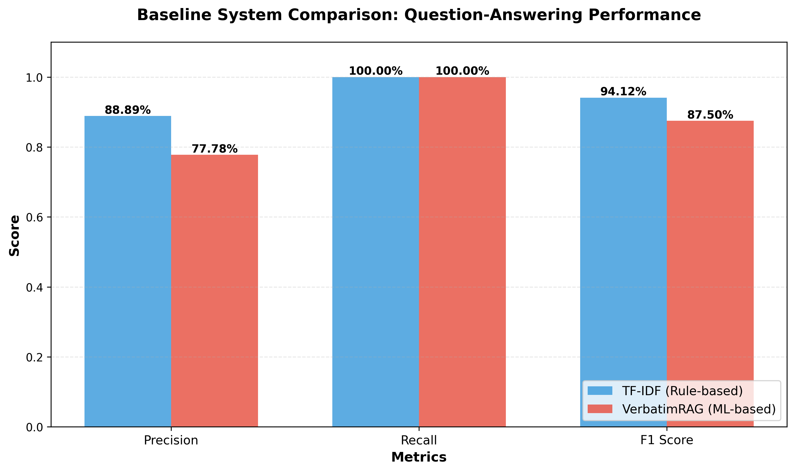

# Milestone 2 Results: TF-IDF vs VerbatimRAG

## Performance Summary

| System | Precision | Recall | F1 | Accuracy |
|--------|-----------|--------|-----|----------|
| **TF-IDF** | **88.89%** | 100% | **94.12%** | **88.89%** |
| VerbatimRAG | 77.78% | 100% | 87.50% | 77.78% |

**Winner: TF-IDF** (8/9 correct vs 7/9)

## Key Findings

**TF-IDF Strengths:**
- Better top-1 precision (88.89% vs 77.78%)
- Excels on queries with specific technical terms

**VerbatimRAG Strengths:**
- Equal Recall@5 performance (88.89%)
- Retrieves correct documents but ranks them lower (MRR: 80.56%)

## Qualitative Examples

### Example 1: Both Systems Succeed ✓✓

**Query:** "Are deep learning methods effective for crime forecasting compared to traditional models?"
- **Ground Truth:** 2509.20913v1 (Deep Learning for Crime Forecasting)
- **TF-IDF:** 2509.20913v1 ✓ | Top-3: [2509.20913v1, 2510.13050v1, 2510.08411v1]
- **VerbatimRAG:** 2509.20913v1 ✓ | Top-3: [2509.20913v1, 2510.10822v1, 2510.08662v1]
- **Analysis:** Both systems correctly matched query terms like "crime forecasting" to paper title.

### Example 2: Both Systems Succeed ✓✓

**Query:** "Which deep learning approaches work well for gamma/hadron separation?"
- **Ground Truth:** 2510.05736v1 (Gamma/Hadron Separation paper)
- **TF-IDF:** 2510.05736v1 ✓ | Top-3: [2510.05736v1, 2510.08116v1, 2510.09187v1]
- **VerbatimRAG:** 2510.05736v1 ✓ | Top-3: [2510.05736v1, 2510.07320v1, 2510.10822v1]
- **Analysis:** Specific technical terms ("gamma/hadron separation") directly matched paper title.

### Example 3: TF-IDF Succeeds, VerbatimRAG Fails ✓✗

**Query:** "How does model selection affect responsiveness in real-time applications?"
- **Ground Truth:** 2510.13137v1 (LSTM vs 3D CNN comparison)
- **TF-IDF:** 2510.13137v1 ✓
- **VerbatimRAG:** 2510.08662v1 ✗ (DPCformer paper, correct answer at rank 4)
- **Analysis:** TF-IDF matched "real-time" + "responsiveness" terms. VerbatimRAG weighted "model selection" too heavily, prioritizing an optimization paper.

### Failure Summary

- **TF-IDF:** 1 failure - "How can I train models stably with limited computational resources?" (expected 2510.12850v1 Ethic-BERT, got 2510.13137v1 LSTM)
- **VerbatimRAG:** 2 failures - same query above (got 2509.20913v1 crime paper) + responsiveness query

### Success Patterns

Both systems excel when queries contain:
- Specific technical vocabulary (gamma/hadron, DPCformer, crime forecasting)
- Terms matching paper titles
- Domain-specific jargon

### Failure Patterns

Systems struggle with:
- General queries using common terms ("limited resources", "training stably")
- Queries requiring semantic understanding beyond keyword matching
- Technique-specific questions with generic phrasing

---

**Test Set:** 9 labeled queries
**Full metrics:** See `confusion_matrix_metrics.csv` and `comparison_metrics.csv`
**Qualitative table:** `qualitative_comparison.md`